# SCHOOL MESSAGE

## Índice

* [1. Preámbulo](#1-preámbulo)
* [2. Resumen del proyecto](#2-resumen-del-proyecto)
* [3. Primer prototipo](#3-primer-prototipo)
* [4. Feedback](#4-feedback)
* [5. Diseño de prototipo](#5-diseño-de-prototipo)
* [6. Vista final del proyecto](#6-vista-final-del-proyecto)
* [7. Objetivos de aprendizaje Cipher](#7-objetivos-de-aprendizaje-Cipher)

***

## 1. Preámbulo

Durante la etapa de formacion de un niño, es necesario que los padres cuenten con la informacion necesaria de su hijo. Esta informacion debe ser ágil, fluida, segura y confidencial para mejorar habilidades, resolver problemas y entre muchas otras cosas que se pueden presentar, por esto veo necesario que tengan un canal de comunicacion exclusivo.
Este proyecto está enfocado en mejorar la comunicación entre el padre de familia y el tutor del alumno en una escuela, con mensajes cifrados padre-profesor.

## 2. Resumen del proyecto

La aplicación web está dirigida a los padres de familia y a los profesores. Los cuales cuentan con un usuario y contraseña para acceder a la aplicación de mensajería cifrada, la aplicación cuenta con dos opciones:

__1. Redactar mensajes:__ en el que debe ingresar el destinatario, el asunto, redactar un mensaje y al final debe ingresar una clave. La clave es importantísima, ya que para poder leer el mensaje se necesita de esta.

__2. Ver mensajes:__ en esta interfaz se podrán ver los mensajes cifrados y será sumamente necesario que tenga la clave para poder leer el mensaje.

Ya que el aplicativo es únicamente entre padres y profesores, ellos manejaran las claves para poder leer los mensajes. Esto hace posible que los mensajes sean totalmente privados.

## 3. Primer prototipo

Esta es una foto del protipo inicial, hecho a lapiz y papel.

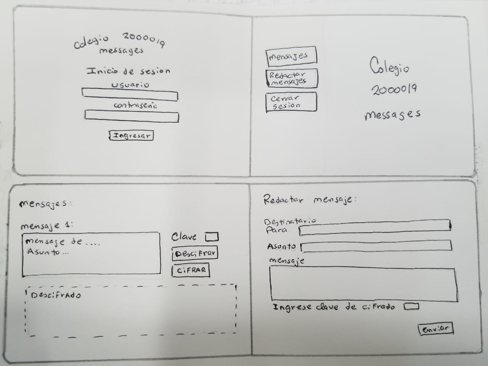

Era un modelo simple, que a mi parecer tenia todo lo que mi proyecto iba a necesitar. Pero despues se hicieron unos cambios necesarios y por estetica.

## 4. Feedback

* Para mejorar la presentación del envió de mensajes y lectura de mensajes, se agregó una nueva interfaz que los muestra aparte.
* También se tuvo que agregar los botones de cerrar sesión y volver a la bandeja principal ,que no tenía contemplados desde el inicio y resultaron super útiles.

## 5. Diseño de prototipo

El primer diseño del prototipo se realizo en Google Slides([Google Slides](https://www.google.com/intl/es/slides/about/)), con los cambios necesarios necesarios:

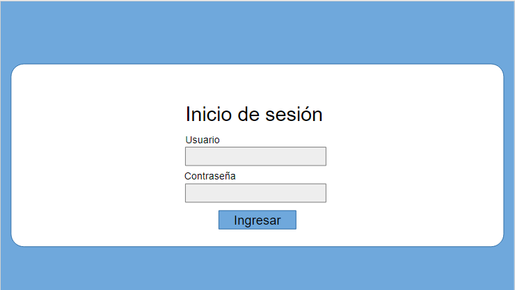

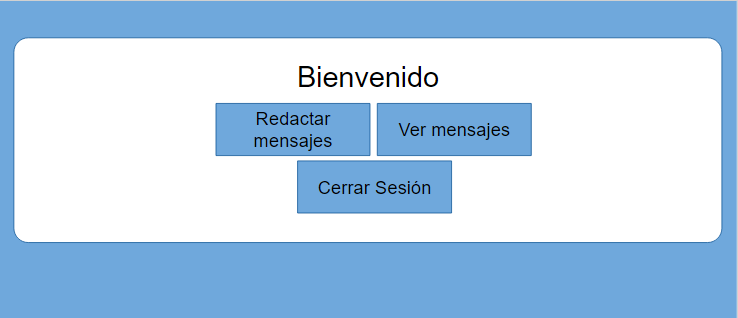

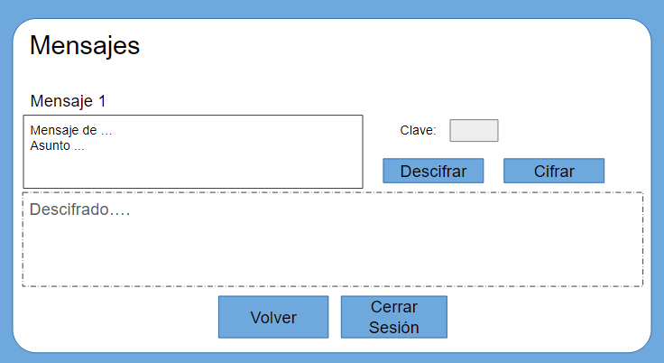

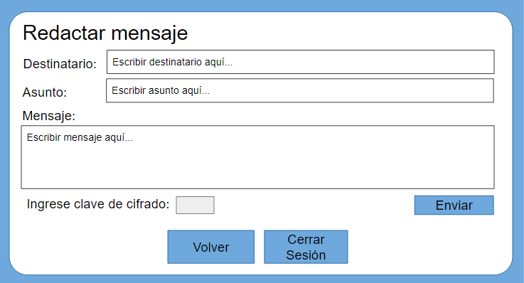

También se probó la herramienta Figma([Figma](https://www.figma.com/)), con una simulacion de botones [aqui](https://www.figma.com/proto/6WJ77F0vjOlvtQ6PDYw4oV/School_Interface?node-id=1%3A3&scaling=scale-down "Figma").

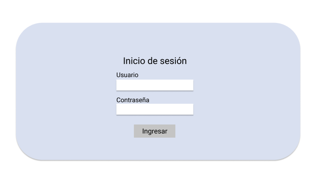

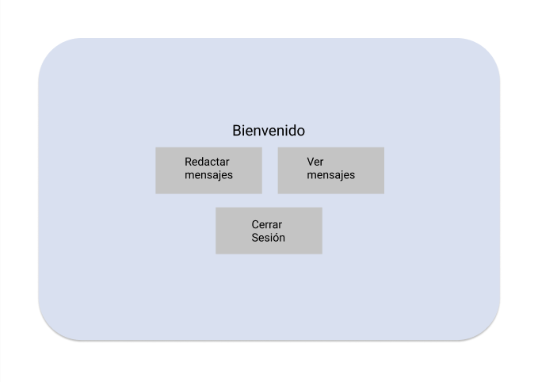

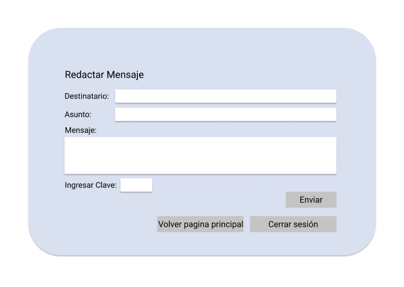

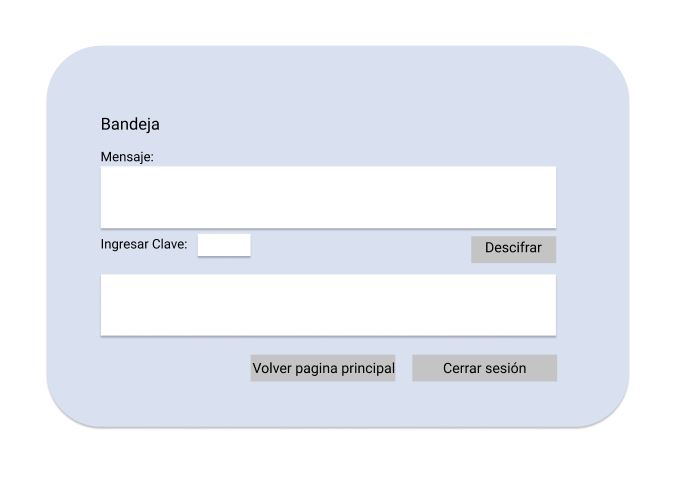

## 6. Vista final del proyecto

Estos son los resultados del proyecto, seguidamente una guía paso a paso:

1. La pantalla de inicio contiene el inicio de sesión.

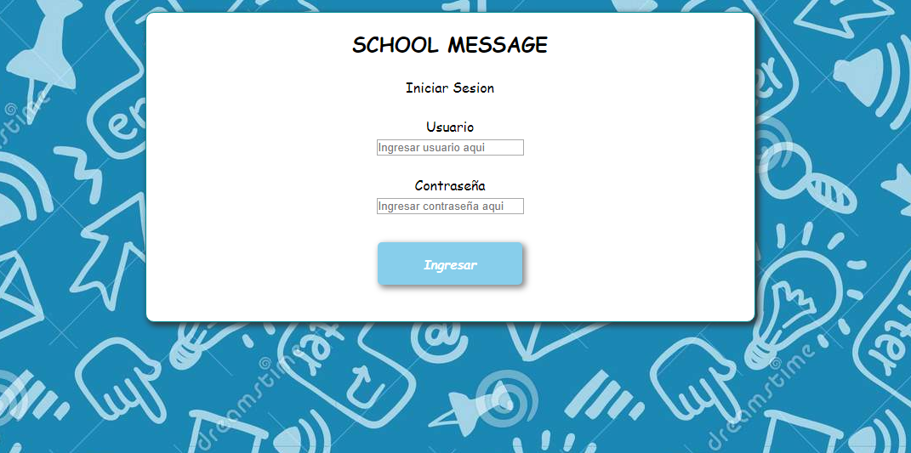

2. Para ingresar deben escribirse los datos correctos y presionar el botón Ingresar.

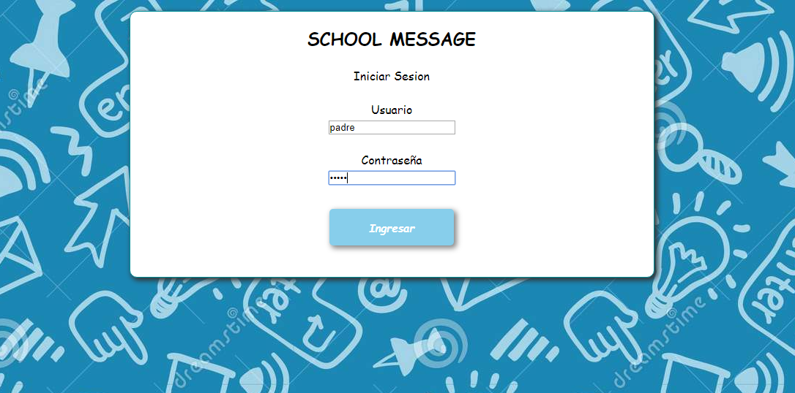

3. En la pantalla de menú se puede escoger entre las opciones de redactar mensaje para crear un nuevo mensaje y ver mensajes para poder ver la bandeja de mensajes. Y aparte el botón de cerrar sesión para salir y volver al login de inicio de sesión.

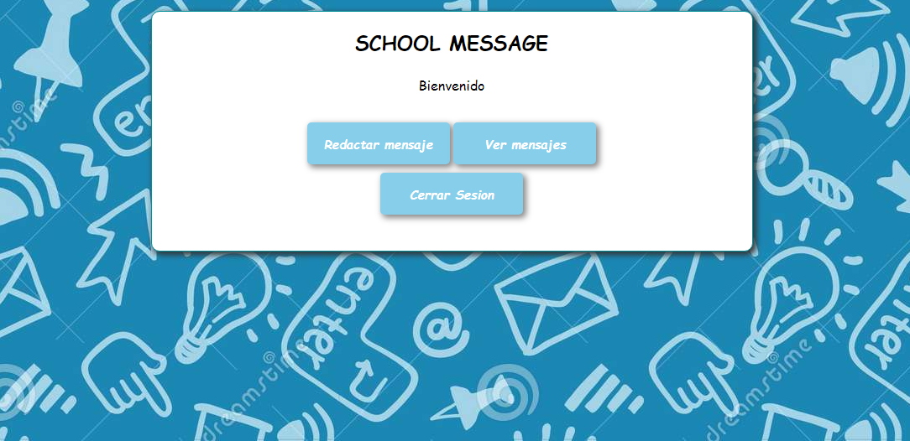

4. En la pantalla de redactar mensaje se ven los campos de destinatario, asunto, mensaje y clave, los que deben estar llenos para poder enviar el mensaje.

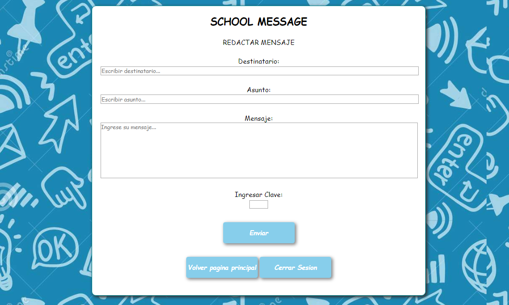

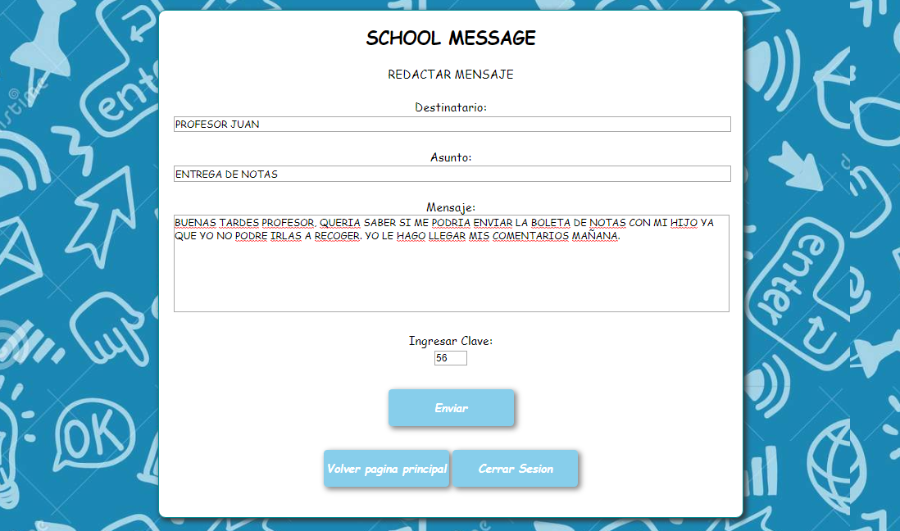

5. Después de presionar el botón enviar muestra el mensaje encriptado y los botones de volver a la pagina principal y cerrar sesión. 

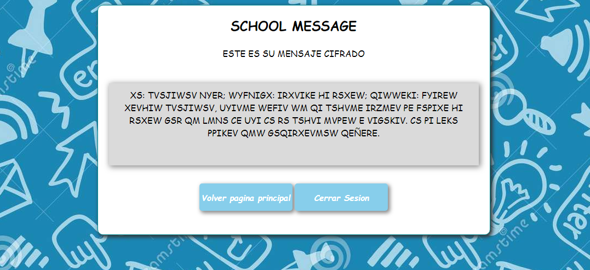

6. En la pantalla de bandeja aparece el mensaje enviado y un espacio para ingresar la clave que descifra el mensaje.

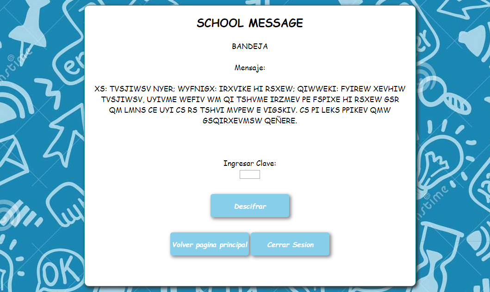

7. Se debe ingresar la clave correcta para poder descifrar el mensaje.

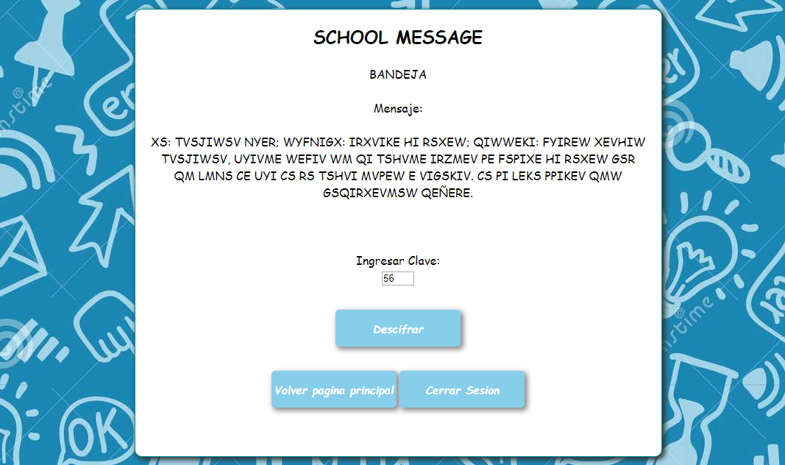

8. Después de presionar el botón descifrar se muestra el mensaje descifrado y los botones de volver a la pagina principal y cerrar sesión.

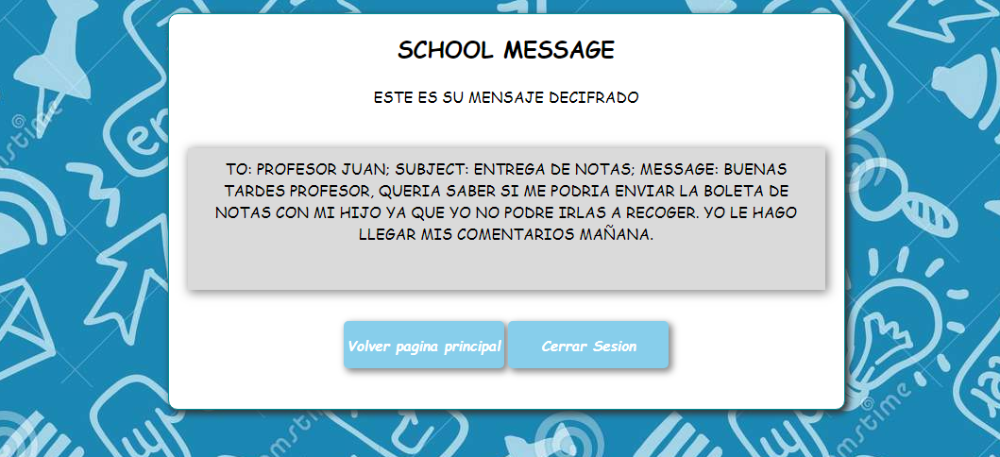

## 7. Objetivos de aprendizaje Cipher
​
A continuación te presentamos los objetivos de aprendizaje de este proyecto. Reflexiona y luego marca los objetivos que has llegado a **entender** y **aplicar** en tu proyecto.
​
### UX
​
- [x] Diseñar la aplicación pensando y entendiendo al usuario.
- [x] Crear prototipos para obtener feedback e iterar.
- [x] Aplicar los principios de diseño visual (contraste, alineación, jerarquía).
​
### HTML y CSS
​
- [x] Uso correcto de HTML semántico.
- [x] Uso de selectores de CSS.
- [x] Construir tu aplicación respetando el diseño realizado (maquetación).
​
### DOM
​
- [x] Uso de selectores del DOM.
- [x] Manejo de eventos del DOM.
- [x] Manipulación dinámica del DOM.
​
### Javascript
​
- [] Manipulación de strings.
- [x] Uso de condicionales (if-else | switch).
- [] Uso de bucles (for | do-while).	
- [] Uso de funciones (parámetros | argumentos | valor de retorno).
- [x] Declaración correcta de variables (const & let).
​
### Testing
- [] Testeo de tus funciones.
​
### Git y GitHub
- [] Comandos de git (add | commit | pull | status | push).
- [] Manejo de repositorios de GitHub (clone | fork | gh-pages).
​
### Buenas prácticas de desarrollo
- [] Uso de identificadores descriptivos (Nomenclatura | Semántica).
- [] Uso de linter para seguir buenas prácticas (ESLINT).